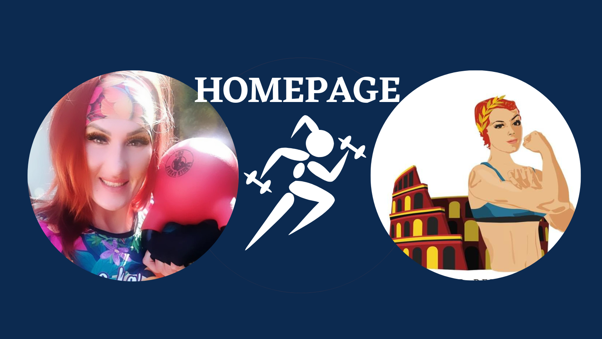

# Marianna Weychan - my first website

## 🦸‍♀️Demo
[Link to the demo](https://marianna-weychan.github.io/Homepage/)

## ⌨️ Short description

My first self-created website presenting briefly my person, professional experience, passions, hobbies, interests and previous achievements.
I created it as part of learning at the YouCode programming school during the course: Frontend Developer from scratch.
## 

## 👩‍💻Used Technoligies:
- HTML,
- CSS,
- BEM convention,
- Java Script,
- Git
